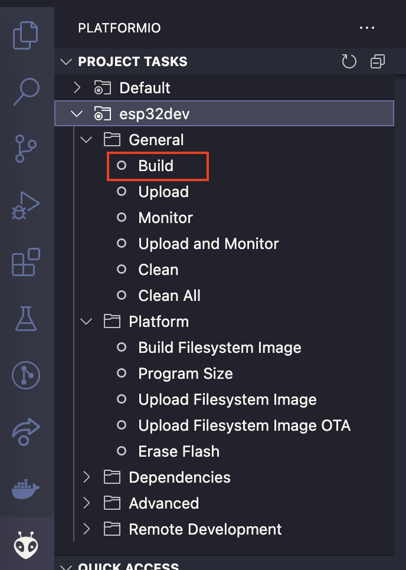
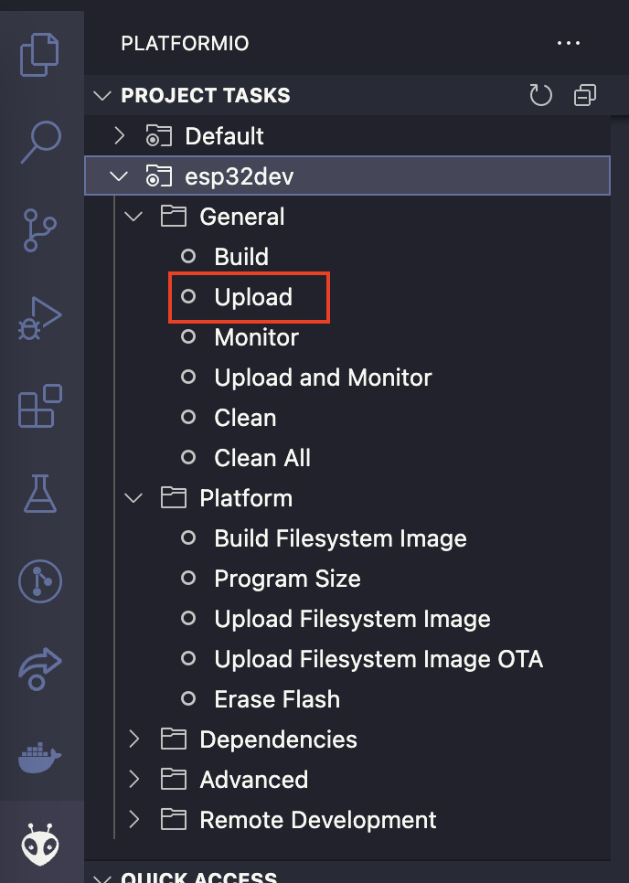
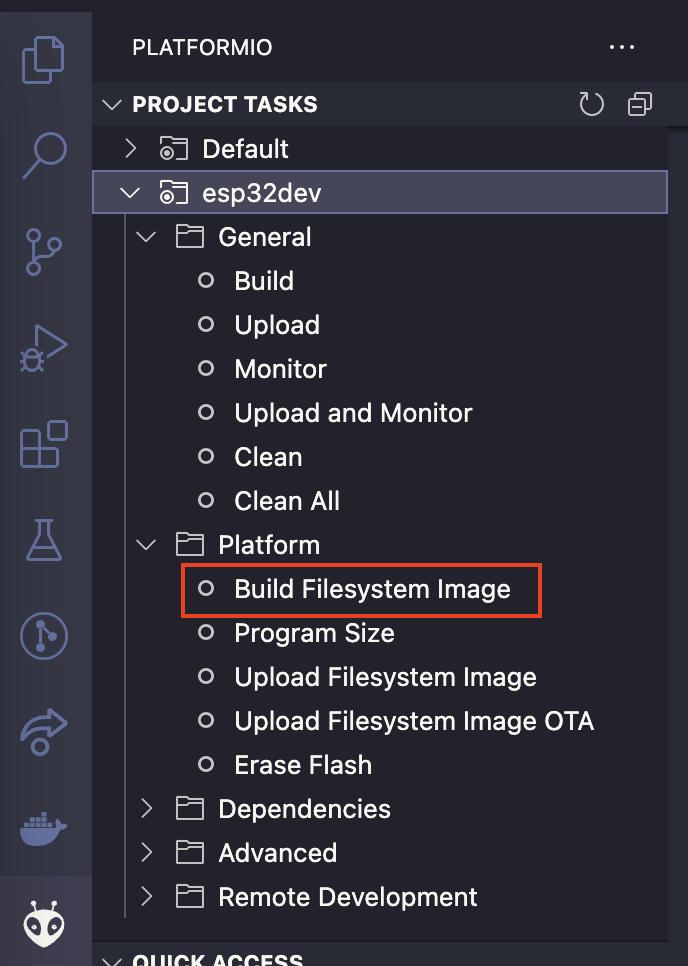
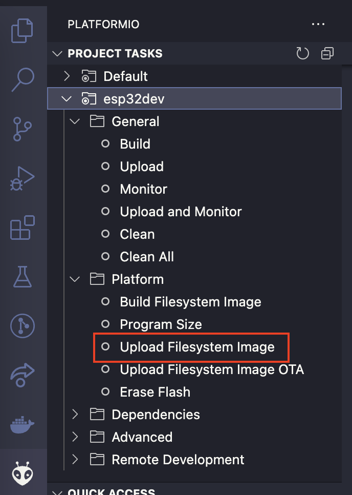

# Tusk

This repo contains the hardware and software related to upgrades being made to the Tastic RFID Thief project.

## Hardware

PCB that houses the batteries for the long range reader, ESP32 microcontroller, and sd-card reader.

## WiFi

### Firmware & Software

#### Overview of the project structure:

```
├── wifi
│   ├── interface					# react frontend web application
│   │   └── src
│   ├── data						# build path of the react frontend
│   ├── src							# backend webserver
│   │   └── main.cpp
│   ├── scripts
│   │   └── build_interface.py		# helper script to build ahd deploy react webserver to /data/ folder
```

#### Build and Deploy Instructions

Use platformio to build and deploy the project.

Build and upload the webserver

<p align="center">
  
  
</p>

Build and upload the react frontend

<p align="center">
  
  
</p>

#### TODO

- add search / filter feature for card data
- use websockets to update card data in less janky way (rather than read entire file everytime?)
- add code to handle card data coming from reader
- switch from writing card data to littlefs in frontend website partition to external sd card
- remove dummy data in `main.cpp`
- write Docs

## Bluetooth

### Firmware

ESP32 firmware that handles card data coming from the reader and sends it over Bluetooth.

Use PlatformIO to build & upload firmware

#### TODO:

- Add functions to write card data to sd-card as backup

### Software

Python client to connect to tusk via bluetooth
